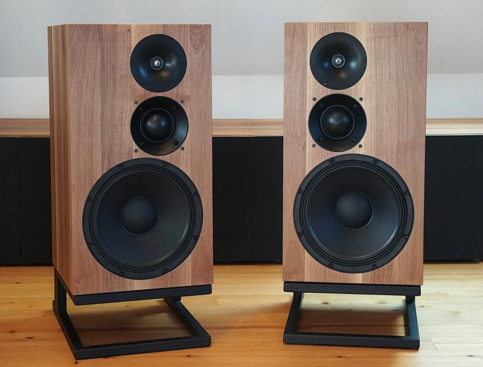

# osmcdoc

Documentation for the Open Source Monkey Coffin.

_picture by mbrennwa, 6.12.2019_

#  The Open Source Monkey Coffin Loudspeaker

## Notes and Disclaimers

This document describes the design of the Open Source Monkey Coffin (OSMC) loudspeaker, which was developed in an "open-source project". The aim of this project is to provide the OSMC design to DIYers for their own private purposes, for example to build a copy of the OSMC. Do not use the information developed in this project on a larger scale without written permission (for example by selling speakers based on the OSMC design or substantial parts of it).

The OSMC development was financially supported by diyAudio members LORD-SANSUI, Paul Vancluysen, George Wright, KaffiMann, Charles Bueche, zimmer64, John Barbor, mbrennwa, and other anonymous members. Thank you!

Matthias Brennwald, December 6, 2019

## Overview

The Open Source Monkey Coffin (OSMC) loudspeaker was developed by members of the diyAudio internet forum.1 The motivation for developing this loud-speaker emerged from two diyAudio threads discussing the idea of "open source" loudspeaker designs. Once the types of loudspeakers that would appeal to many novice DIYers were identified, the design targets for the OSMC were defined as follows:

- The OSMC must be straight forward to make for DIY novices.
- The box format should follow the “large monitor” format, sometimes also referred to as "monkey coffin" (hence the name). The internal volume should
not be larger than 60–80 L. The enclosure must be a simple rectangular box which is easy enough to make on a kitchen table.
- The OSMC should be "amplifier friendly". It should work well with small amplifiers like the popular Amp-Camp-Amp, tube amps, etc.
- The OSMC should be a three way loudspeaker.
- Keeping part costs low is not of paramount priority. If the right parts cost a lot of money and there are no cheaper equivalents, it’s okay to use those
parts in the design.
- the loudpseaker efficiency was targeted to 92 dB−SPL at 1 m and 2.83 V input voltage, with a bass extension to 45 Hz (−3 dB).
- The impedance curve must not exhibit any sharp peaks or dips, and the OSMC should qualify as an "8 Ω speaker".

## Resources

- [Github repository](https://github.com/mbrennwa/osmcdoc)
- [forum thread on diyaudio.com](https://www.diyaudio.com/forums/multi-way/327594-source-monkey-box.html)
